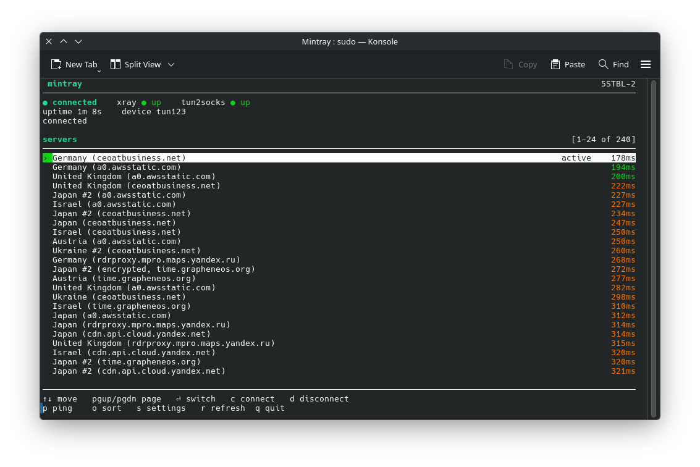
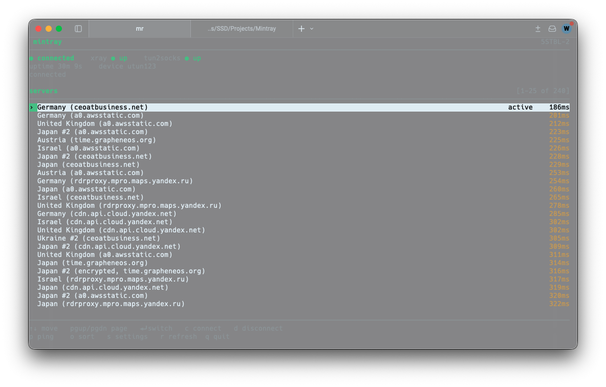

# Mintray

Mintray is a proxy client for macOS and Linux. For your privacy and freedom. No dependencies, TUI only _(works even on bare servers where no desktop env just fine over SSH)_. Project is open-source and GitHub issues & email (in commits only, GitHub pinned email are not read) are there for any bugs.

- [Russian language/Русский язык/俄语长](README_RU.md) _(will be not maintained)_
- [Chinese language/中文/Китайский язык](README_CH.md) _(will be not maintained)_

## Supported protocols
- `Vless`: by Xray package
_support for protos like Hysteria2 & VMess & Trojan is coming soon_

## Showcase/Demo

**Linux** _(CachyOS, Console as terminal)_


**macOS** _(Tahoe, Warp as terminal. Terminal has white background because macOS captures only the window without background)_

-----------
## Why Mintray
- **No dependencies.** _(Works without ANY dependencies on bare Linux & macOS machine in full capabilities)_
- **Works the same way on macOS and Linux** _(no separate app to learn per platform)_
- **TUN Mode.** _(routes all traffic except local trough proxy)_
- **Lightweight** _(no heavy app service, just a Python3)_
- **Simple design** _(a clean, simple terminal design that works for everyone)_
-----------
## Get MintRay
- [**GitHub Releases**](https://github.com/dev4ones-space/Mintray/releases) _(always up-to-date, first priority)_
-----------
## How to use
### Mintray supports connections _(servers)_ by subsciption provider/s and JSON Xray
- **How to add subsciption to Mintray**:
  ```bash
  mintray --add-sub [https URL] 
  ```
  _(after that Mintray will work, this command is enough/max to work)_
- **How to add Xray conf to Mintray**:
  ```bash
  mintray --config [xray conf]
  ```
  _(after that Mintray will work, this command is enough/max to work)_
#### Note! Please use `--help` for more information on arguments, some of the, may resolve your request/issue
-----------
## Some other info
1. UDP may not work properly - Xray core thing _(we cannot fix or do anything about this, so something that uses UDP may just not work, ex. Whatsapp calls or just WebRTC in general)_
2. Windows isn't supported. _(1. No build-in stdlib - no curses (that's the main interface, required). 2. Too strict (like no actual root implementation) 3. Network compatbility issues - it's gotta be a another implementation of entire network stack (macOS & Linux are basically compatible with each other in a safe way))_
3. It may not run on Linux - everything has been tested enough and noted that it works in full capabilities on Linux and macOS, but Linux has too many distros families and we cannot optimize app for each one. Here's the list of confirmed working OS:
- macOS _(100% compatbility for Ventura and higher, updates never touch things that may break)_
- CachyOS & Arch (Linux distro, Arch Linux based distros will probably work just fine)_
--------
## Building from source

```bash
git clone https://github.com/dev4ones-space/Mintray.git
cd Mintray
```
Grab last release of binaries in following repos

[XTLS/Xray-core](https://github.com/XTLS/Xray-core/releases)

[xjasonlyu/tun2socks](https://github.com/xjasonlyu/tun2socks/releases)
```bash
pip install pyinstaller
mkdir bin && cp /path/to/xray /path/to/tun2socks bin/
pyinstaller Mintray.spec
```

## Building from source (step-by-step)
_(all of this requires Python3 to be installed in your `$PATH`, download installer from [python.org](https://www.python.org/downloads/))_
1. Clone the repo && cd after: _(`cd` changes the directory your terminal is currently in)_
```bash
git clone https://github.com/dev4ones-space/Mintray.git && cd Mintray
```
2. Collect binaries for your current device: _(specifications like device arch (x84_64, aarch64/arm) and OS (darwin for macOS or just linux))_
- **[XTLS/Xray-core](https://github.com/XTLS/Xray-core/releases)**
- **[xjasonlyu/tun2socks](https://github.com/xjasonlyu/tun2socks/releases)**
3. Install PyInstaller module for Python: _(requires pip to be installer & work properly)_
```bash
pip install pyinstaller
```
or
```bash
python3 -m pip install pyinstaller
```
_(also, if installation fail because of error externally managed, add this argument to command: `--break-system-packages`)_

4. Create `bin/` directory & put binaries in it: _(requires slight command changing to work by editing path)_
```bash
mkdir bin && cp /path/to/xray /path/to/tun2socks bin/
```
5. Build binary:
```
pyinstaller Mintray.spec
```
or
```
python3 -m PyInstaller Mintray.spec
```

### After all of that it, fully working executable binary should be build in `dist/Mintray` 
------
## Notice for users
#### We, at YZYWORKS, think that privacy is a human right and everyone deserves it. 
#### We are pro-privacy, and we never log that you do trough client or through our services.
#### [Claim free proxy for your privacy](mailto:proxy@yzyworks.com). We provide free plan with 512GB for month with unlimited speeds, if you want - you can order paid plan that provides same things, just unlimited traffic.
#### This is not an ad, this is a recommendation of our service, which is free for everyone _(we do not discriminate or care where you are or what nation you in - for everyone)_
