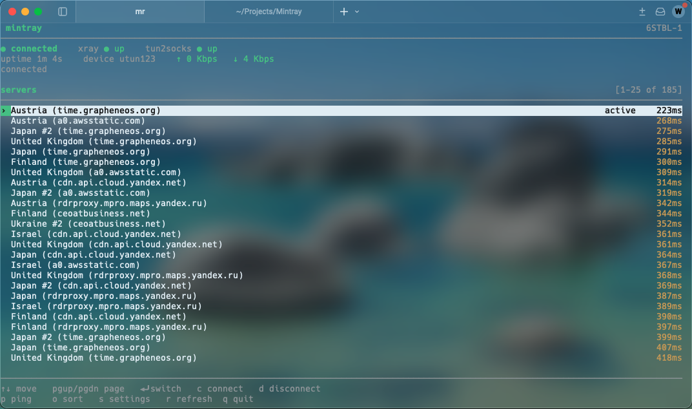

# Mintray

Mintray — прокси-клиент для macOS и Linux. Для вашей приватности и свободы.

Без зависимостей, только TUI. Проект с открытым исходным кодом, вкладка Issues и почта — для любых багов.

- [English language/Английский язык/英语](index.md) _(обновляется при каждом релизе)_
- [Chinese language/中文/Китайский язык](indexChinese.md) _(обновляется при каждом релизе)_

## Поддерживаемые протоколы
- **Vless** _(полная поддержка всех транспортов и шифрования)_. Предоставляется пакетом Xray (`bin/xray`)
- **Socks5**
- **Trojan**. Предоставляется пакетом Xray (`bin/xray`)
- **Shadowsocks**
- **Hysteria2**. Предоставляется пакетом Hysteria2 (`bin/hysteria2`)
-----------
## Демонстрация
**Linux** _(CachyOS, терминал Console)_


**macOS** _(Tahoe, терминал Warp)_

-----------
## Почему Mintray
- **Без зависимостей** _(работает без каких-либо зависимостей на чистой машине с Linux и macOS в полном объёме возможностей, с помощью бинарника)_
- **Работает одинаково на macOS и Linux** _(не нужно изучать отдельное приложение под каждую платформу)_
- **Режим TUN** _(маршрутизирует весь трафик, кроме локального, через прокси)_
- **Лёгкий** _(нужен только Python3, запустится на любой машине без проблем)_
- **Простой дизайн** _(чистый, простой терминальный интерфейс, понятный каждому)_
- **Открытый исходный код** _(большинство клиентов закрытые, мы же полностью прозрачны во всём)_
-----------
## Получить Mintray _(готовые бинарники и репозиторий)_
- [**Репозиторий Mintray**](https://yzyworks.com/git/Mintray/) _(в приоритете, содержит исходный код и прочее)_
- [**GitHub**](https://github.com/dev4ones-space/Mintray/releases) _(во вторую очередь, только релизы и README)_
-----------
## Как пользоваться
### Mintray поддерживает подключения _(серверы)_ от провайдера/ов подписки
- **Как добавить подписку в Mintray**:
  ```bash
  mintray --add-sub [https URL] 
  ```
  _(после этого Mintray заработает)_
  
#### Обратите внимание! Используйте `--help`, чтобы получить больше информации об аргументах — некоторые из них могут решить вашу проблему/запрос
-----------
## Дополнительная информация
1. UDP может работать некорректно с Vless — особенность ядра Xray _(мы не можем это исправить или как-то повлиять, поэтому всё, что использует UDP, может просто не работать, например звонки в WhatsApp или WebRTC в целом)_
2. Windows не поддерживается. _(1. Нет встроенной stdlib — нет curses (это основной интерфейс, он обязателен). 2. Слишком строгая система (например, нет полноценной реализации root). 3. Проблемы с сетевой совместимостью — потребовалась бы отдельная реализация всего сетевого стека (macOS и Linux в целом безопасно совместимы друг с другом))_
3. Возможно, приложение не запустится на Linux — всё было достаточно протестировано, и отмечено, что оно работает в полном объёме на Linux и macOS, но у Linux слишком много семейств дистрибутивов, и мы не можем оптимизировать приложение под каждый из них. Вот список подтверждённо работающих ОС:
- macOS _(100% совместимость с Ventura и новее, обновления никогда не затрагивают то, что может что-то сломать)_
- CachyOS и Arch _(дистрибутивы Linux. Дистрибутивы на основе Arch Linux будут работать, Debian и прочие — могут не работать)_
--------
## Сборка из исходного кода

```
git clone https://yzyworks.com/git/Mintray/.git
cd Mintray
```
Возьмите последний релиз бинарников в следующих репозиториях

[XTLS/Xray-core](https://github.com/XTLS/Xray-core/releases)

[xjasonlyu/tun2socks](https://github.com/xjasonlyu/tun2socks/releases)

**[apernet/hysteria](https://github.com/apernet/hysteria/releases)**
```
pip install pyinstaller
mkdir bin && cp /path/to/xray /path/to/tun2socks bin/
pyinstaller Mintray.spec
```

## Сборка из исходного кода (пошагово)
_(для всего этого требуется установленный Python3 в вашем `$PATH`, скачайте установщик с [python.org](https://www.python.org/downloads/))_
1. Клонируйте репозиторий и перейдите в папку: _(`cd` меняет текущую директорию терминала)_
```
git clone https://yzyworks.com/git/Mintray/.git && cd Mintray
```
2. Соберите бинарники под ваше устройство: _(укажите архитектуру устройства (x84_64, aarch64/arm) и ОС (darwin для macOS или просто linux))_
- **[XTLS/Xray-core](https://github.com/XTLS/Xray-core/releases)**
- **[xjasonlyu/tun2socks](https://github.com/xjasonlyu/tun2socks/releases)**
- **[apernet/hysteria](https://github.com/apernet/hysteria/releases)**
3. Установите модуль PyInstaller для Python: _(требует установленный и рабочий pip)_
```
pip install pyinstaller
```
или
```
python3 -m pip install pyinstaller
```
_(также, если установка не удаётся из-за ошибки externally managed, добавьте к команде аргумент: `--break-system-packages`)_

4. Создайте директорию `bin/` и поместите в неё бинарники: _(потребуется немного изменить путь в команде)_
```
mkdir bin && cp /path/to/xray /path/to/tun2socks bin/
```
5. Соберите бинарник:
```
pyinstaller Mintray.spec
```
или
```
python3 -m PyInstaller Mintray.spec
```

### После всего этого полностью рабочий исполняемый файл должен собраться в `dist/Mintray`
------
## Уведомление для пользователей
#### В YZYWORKS мы считаем, что приватность — это право человека, и каждый её заслуживает.
#### Мы за приватность и никогда не ведём логи того, что вы делаете через этот клиент.
#### [Получить бесплатный Vless-прокси для ВАШЕЙ приватности](mailto:proxy@yzyworks.com). _(политика отсутствия логов, полная политика конфиденциальности доступна [здесь](https://yzyworks.com/mdr?source=yzyproxy/PrivacyPolicy.md))_ Мы предоставляем бесплатный план с 512 ГБ трафика в месяц без ограничения скорости, а если хотите — можно заказать платный план с теми же условиями, но без ограничения трафика.
#### Это не реклама, это рекомендация нашего сервиса, который бесплатен для всех _(мы никого не дискриминируем и не важно, откуда вы и какой вы национальности — для всех)_
